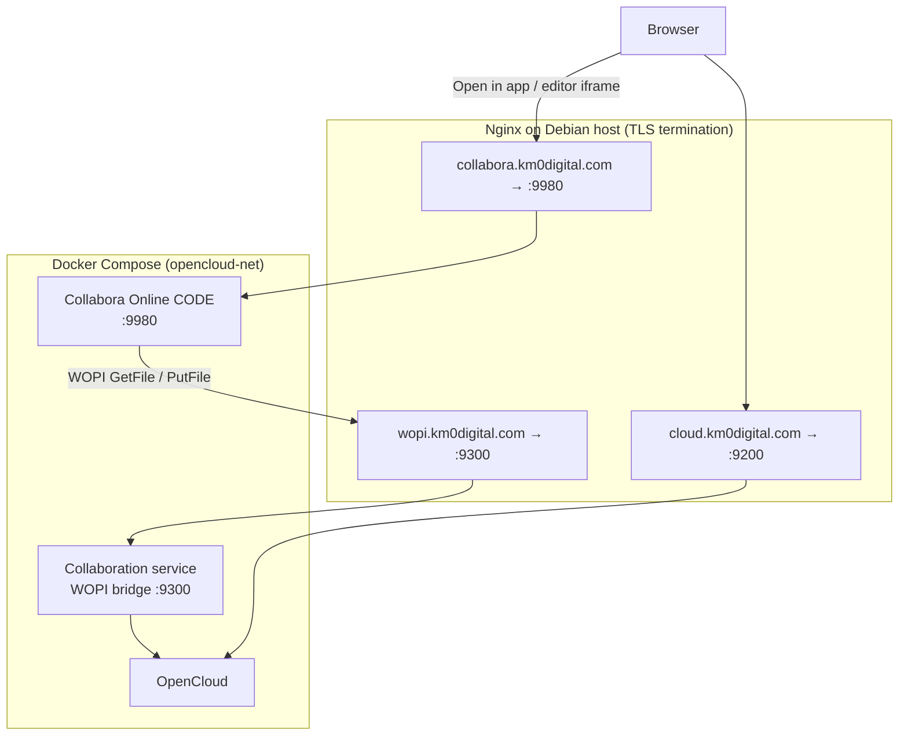
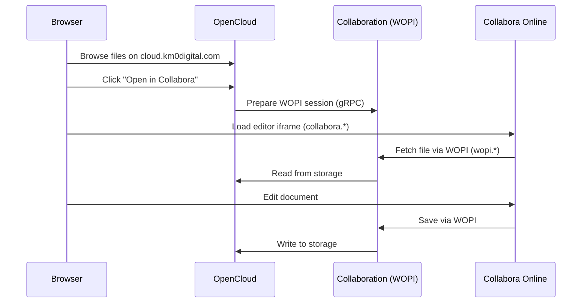

# Pre-plan: Collabora Online (browser document editing) for km0-opencloud

> **Purpose:** GitHub issue draft for implementing self-hosted Collabora Online with the OpenCloud collaboration (WOPI) service.  
> **Target:** `cloud.km0digital.com` on Debian 13, Nginx external proxy, Dex OIDC.  
> **Cost model:** Fully self-hosted — **no SaaS subscription** (Collabora Online CODE is free/open source).

---

## Goal

Enable **in-browser editing and co-editing** of Office documents (`.docx`, `.xlsx`, `.pptx`, etc.) stored in OpenCloud, without sending file content to Microsoft 365 or Google Workspace.

Users should be able to:

1. Open a supported file from the OpenCloud web UI (“Open in app”).
2. Edit it in Collabora Online inside the browser.
3. Save changes back to OpenCloud storage automatically via WOPI.

We want a **production-ready** integration that follows upstream [opencloud-compose](https://github.com/opencloud-eu/opencloud-compose) patterns and km0 conventions (`overrides/`, Nginx templates, runbook updates).

---

## Current context (what we already have)

| Item | Value |
|------|--------|
| OpenCloud | `opencloudeu/opencloud-rolling:7.0.0` |
| Public URL | `https://cloud.km0digital.com` |
| Compose mode | `external-proxy/opencloud.yml` (loopback `127.0.0.1:9200`) |
| TLS | Nginx + Let's Encrypt on the host |
| Auth | Dex OIDC (+ Google connector); built-in IDP kept for local login |
| Storage | Embedded Decomposed FS + BoltDB IDM (no external DB) |
| Server RAM | **16 GB** (sufficient for Collabora CODE) |
| Explicitly **not** deployed today | Collabora, WOPI/collaboration service |

Repository stance today: **core deployment only** — see `README.md` (“no Collabora/WOPI”) and `overrides/opencloud-compose/.env.debian-core-external-proxy.example`.

Partial preparation already exists:

- CSP placeholders for `COLLABORA_DOMAIN` in `overrides/opencloud-compose/config/opencloud/csp.yaml`
- Upstream compose overlays: `weboffice/collabora.yml`, `external-proxy/collabora.yml`

---

## Tooling context

### Collabora Online CODE

- **What:** LibreOffice-based online office suite (document/spreadsheet/presentation editor in the browser).
- **Edition:** **CODE** (Collabora Online Development Edition) — free, open source, self-hosted.
- **Docker image:** `collabora/code` (pinned in upstream compose, e.g. `25.04.x`).
- **Docs:** <https://www.collaboraonline.com/code/>
- **GitHub:** <https://github.com/CollaboraOnline/online>
- **Release notes:** <https://www.collaboraonline.com/release-notes/>

### OpenCloud collaboration (WOPI) service

- **What:** Bridge between OpenCloud and a Web Office app using the **WOPI** protocol.
- **Runs as:** `opencloud collaboration server` (separate container, same image as OpenCloud).
- **Docs:** <https://doc.opencloud.eu/> (collaboration / web office sections) · <https://owncloud.dev/services/collaboration/>
- **Upstream compose:** `opencloud-compose/weboffice/collabora.yml`

### Licensing / cost

| Component | License / cost |
|-----------|----------------|
| Collabora Online CODE | **Free** (MPL 2.0); no vendor API key |
| OpenCloud collaboration service | Part of OpenCloud stack |
| Infrastructure | Existing server; no per-user SaaS fee |

Optional paid path (out of scope): Collabora-supported enterprise build with SLA — **not required** for this task.

---

## Target architecture

### Component diagram



### Edit session (sequence)



### Why three hostnames (not one)

OpenCloud, Collabora, and the WOPI bridge are **three separate HTTP services** on different container ports. Upstream compose and Collabora security settings (`aliasgroup1`, `net.frame_ancestors`, CSP `frame-src`) assume **distinct HTTPS origins**:

| Hostname (proposed) | Backend | Port (loopback) |
|---------------------|---------|-----------------|
| `cloud.km0digital.com` | OpenCloud | `127.0.0.1:9200` |
| `collabora.km0digital.com` | Collabora CODE | `127.0.0.1:9980` |
| `wopi.km0digital.com` | Collaboration / WOPI | `127.0.0.1:9300` |

All three DNS records point to the **same server IP**; Nginx routes by `server_name`. This is not three servers — it is one server with three virtual hosts.

Path-based routing on a single hostname is possible in theory but **not** how upstream `opencloud-compose` is designed; separate subdomains is the supported and simpler path.

---

## Implementation scope

### In scope

- [ ] Extend `COMPOSE_FILE` with `weboffice/collabora.yml` + `external-proxy/collabora.yml`
- [ ] Add Collabora-related variables to km0 `.env` template (`COLLABORA_DOMAIN`, `WOPISERVER_DOMAIN`, admin credentials, SSL flags for reverse-proxy mode)
- [ ] Nginx vhost templates for `collabora.*` and `wopi.*` (loopback proxy, ACME, long timeouts, WebSocket if needed)
- [ ] Issue TLS certificates (Let's Encrypt) for new hostnames
- [ ] Apply/verify CSP (`COLLABORA_DOMAIN` in `csp.yaml`)
- [ ] Ensure OpenCloud exposes NATS/gateway settings required by collaboration service (per upstream `weboffice/collabora.yml`)
- [ ] Update `docs/runbook.md` and `README.md` (architecture, ports, ops commands)
- [ ] Smoke test + co-editing test documented below

### Out of scope (unless explicitly added)

- ONLYOFFICE or Microsoft 365 integration
- Collabora enterprise/support contract
- Microsoft Core Fonts installer on host (optional fidelity improvement)
- Antivirus pipeline for uploaded Office files

---

## Human prerequisites (cannot be fully automated)

These items require **operator action** before end-to-end testing:

| Prerequisite | Owner | Notes |
|--------------|-------|-------|
| DNS `A`/`AAAA` for `collabora.km0digital.com` | Operator | Same server IP as `cloud.km0digital.com` |
| DNS `A`/`AAAA` for `wopi.km0digital.com` | Operator | Same server IP |
| Choose `COLLABORA_ADMIN_PASSWORD` | Operator | Self-hosted admin console only; not a vendor API key |
| Confirm subdomain names | Operator | `wopiserver.*` is upstream default name; `wopi.*` is fine if consistent in `.env` + Nginx |
| Let's Encrypt issuance | Operator or agent on host | Needs live DNS first (`certbot` webroot) |

**No external SaaS tokens** are required (unlike Google OAuth for mail or OIDC). Collabora CODE does not need a Collabora Cloud account or paid API key.

---

## Recommended implementation approach

1. **DNS first** — Create both subdomains pointing to the server; wait for propagation.
2. **Branch + overrides** — Work on `main` per km0 rules; patch via `overrides/` + `scripts/apply-opencloud-compose-overrides.sh`, not by editing upstream `opencloud-compose/` directly.
3. **Compose layering** — Start from upstream example:
   ```bash
   COMPOSE_FILE=docker-compose.yml:weboffice/collabora.yml:external-proxy/opencloud.yml:external-proxy/collabora.yml
   ```
4. **Reverse-proxy SSL flags** — With Nginx terminating TLS, set (per upstream `.env.example`):
   - `COLLABORA_SSL_ENABLE=false`
   - `COLLABORA_SSL_VERIFICATION=false` (or enable verification if Collabora talks HTTPS to WOPI through Nginx with valid certs)
   - `INSECURE=false` for production
5. **Nginx** — Mirror the OpenCloud vhost pattern:
   - `:80` ACME webroot + redirect
   - `:443` proxy to `127.0.0.1:9980` (Collabora) and `127.0.0.1:9300` (WOPI)
   - Large `client_max_body_size`, long proxy timeouts (office sessions)
   - `proxy_buffering off` where streaming applies
6. **Collabora `extra_params`** — Upstream sets `net.frame_ancestors` and `net.lok_allow.host` to `OC_DOMAIN`; verify they match `cloud.km0digital.com` after deploy.
7. **Rollout** — `docker compose pull && docker compose up -d`; watch `collabora` healthcheck (`/hosting/discovery`).
8. **Rollback plan** — Revert `COMPOSE_FILE` to core-only overlay; remove/disable Nginx vhosts; `docker compose up -d`; DNS can remain unused.

---

## Configuration reference (draft values)

```env
# Add to opencloud-compose/.env (operator fills secrets)
COMPOSE_FILE=docker-compose.yml:weboffice/collabora.yml:external-proxy/opencloud.yml:external-proxy/collabora.yml

COLLABORA_DOMAIN=collabora.km0digital.com
WOPISERVER_DOMAIN=wopi.km0digital.com

COLLABORA_ADMIN_USER=admin
COLLABORA_ADMIN_PASSWORD=<operator-chosen-strong-password>

COLLABORA_SSL_ENABLE=false
COLLABORA_SSL_VERIFICATION=false
# COLLABORA_HOME_MODE=false  # optional; limits concurrent docs on small installs
```

Collabora admin UI (after deploy):  
`https://collabora.km0digital.com/browser/dist/admin/admin.html`

---

## Test plan

### Infrastructure checks

```bash
# DNS
dig +short collabora.km0digital.com A
dig +short wopi.km0digital.com A

# TLS
curl -sI https://collabora.km0digital.com/hosting/discovery | head
curl -sI https://wopi.km0digital.com | head

# Containers
cd /opt/opencloud/opencloud-compose
docker compose ps
docker compose logs --tail=50 collabora collaboration opencloud
```

### Functional tests

| # | Test | Expected result |
|---|------|-----------------|
| 1 | Log in to OpenCloud via Dex | Session OK |
| 2 | Upload `test.docx` | File visible in UI |
| 3 | Open → “Collabora” / “Open in app” | Editor loads in iframe; no CSP/frame error in browser console |
| 4 | Edit text, wait for autosave, close, reopen | Changes persisted |
| 5 | Two browsers/users open same file | Co-editing works (cursors/changes visible) |
| 6 | `.xlsx` and `.pptx` smoke test | Opens without error |
| 7 | Download edited file, open in desktop LibreOffice/Word | Content matches |

### Failure signals

- Browser console: CSP `frame-src` / `frame-ancestors` violations → fix `csp.yaml` and Collabora `extra_params`
- Collabora logs: WOPI URL mismatch → check `WOPISERVER_DOMAIN`, `aliasgroup1`, Nginx `server_name`
- Collaboration service cannot reach OpenCloud NATS → check `MICRO_REGISTRY_ADDRESS` and `NATS_NATS_HOST` from upstream overlay
- 502 from Nginx → container not healthy or wrong loopback port

---

## Acceptance criteria

- [ ] Supported Office files open in Collabora from OpenCloud UI on production hostname
- [ ] Edits save back to OpenCloud storage reliably
- [ ] Two-user co-editing verified on at least one document
- [ ] No regression: Dex login, file upload/download, existing OIDC flow on `cloud.km0digital.com`
- [ ] Runbook updated with new hostnames, ports, and troubleshooting notes
- [ ] Secrets only in `opencloud-compose/.env` (never committed)

---

## References

| Resource | URL |
|----------|-----|
| OpenCloud docs | <https://docs.opencloud.eu/> |
| opencloud-compose | <https://github.com/opencloud-eu/opencloud-compose> |
| Collabora CODE | <https://www.collaboraonline.com/code/> |
| Collabora Online (GitHub) | <https://github.com/CollaboraOnline/online> |
| ownCloud collaboration service | <https://owncloud.dev/services/collaboration/> |
| km0 runbook | `docs/runbook.md` |
| km0 README | `README.md` |
